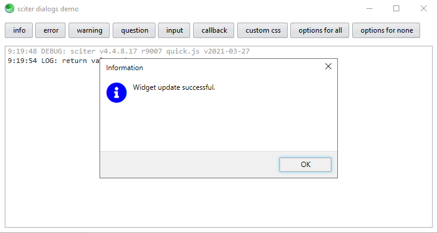

# sciter dialogs

This project implements modal dialogs for [sciter.js](https://sciter.com/).



## features

- modal dialog with icon
- skinnable
- help button opens external link
- translatable using callback

## demo

- git clone the repository
- run `install.bat` to download the latest sciter binaries and the sciter package manager
- install packages `php spm.phar install`
- update fontawesome path to `../vendor/8ctopus/sciter-fontawesome/src/css/fontawesome.css` in `dialog.htm`
- run `scapp.bat`
- to refresh the app after changes to the html/css click `F5`

## install

- add the `src` dir to your project or use the sciter package manager
- in `<script type="module">`

```js
import {dialogs} from "src/dialogs.js";

let value = dialogs.show("question", "Do you want to update widget?", "yes no cancel");

```

### css skinning

```js
dialogs.setOptions({
    css: [
        __DIR__ + "src/dialog-win.css",
        __DIR__ + "css/test.css",
    ]
});
```

### translation callback

```js
dialogs.setOptions({
    callback: dialogCallback,
});

/**
 * Dialog callback
 * @param DOMElement root
 * @return void
 */
function dialogCallback(root)
{
    // get all dialog elements to translate
    root.$$("[data-i18n]").map(function(element) {
        element.innerHTML += " (i18n)";
    });
}
```

# todo

- add "don't show again" checkbox
- add keyboard shortcuts to buttons &#818;

# known issues

- fix fontawesome css include
